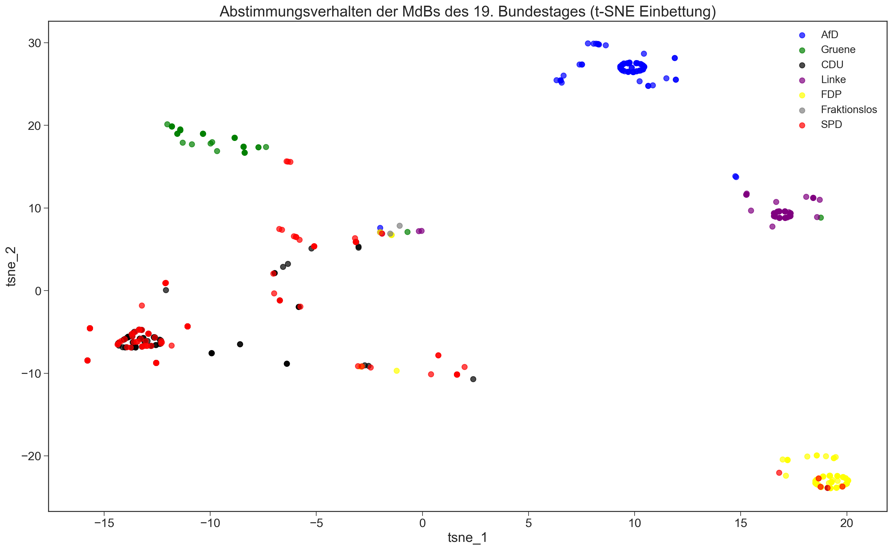

# Bundestag votes

## Requirements

The build scripts are using many command line tools.

- `curl` and `wget` must be available from the command line.

- `make` and `bash` for the building.

- `python 2` with typical data science libraries, if you want to redo the analysis.

- `cvskit` in particular `in2csv` is used for Excel to csv conversion.

- `xmllint`

## Using make

`make clean data` will fetch the voting patterns as `.xls` files from the `bundestag.de` page, convert them to the `.cvs` format, and finally preprocesses/aggregates it into `data/preprocessed/voting.csv` which can be used for analysis.

## Notebooks

Once `voting.csv` is present you can take a look at the notebooks, `notebooks/Analysis.ipynb` should be the most interesting so far.

Here is the visualization of the voting patterns, each dot is a member of the parliament colored in its factions. There is a small transparency, so overlaps are shown, too. From the $12$ votes so far a vector is build to have for each vote either the value: $1$ for "yes", $-1$ for "no", and "0" for abstained (being there and not passing the vote), corrupt, or absent (not being at the parliament at all). These $12$ dimensional vectors are then projected onto two dimensions via the t-SNE algorithm that gives more interesting insights than PCA in this case (in PCA you have the major axis being conformant-contrarian, and the next one - far weaker - is left-right). 

